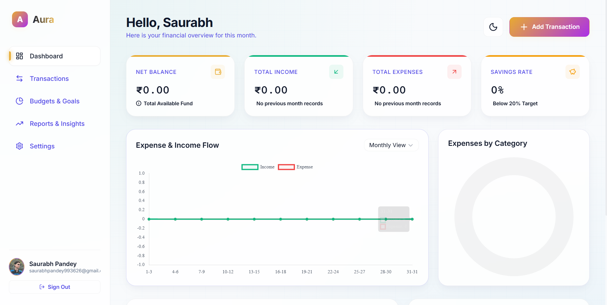
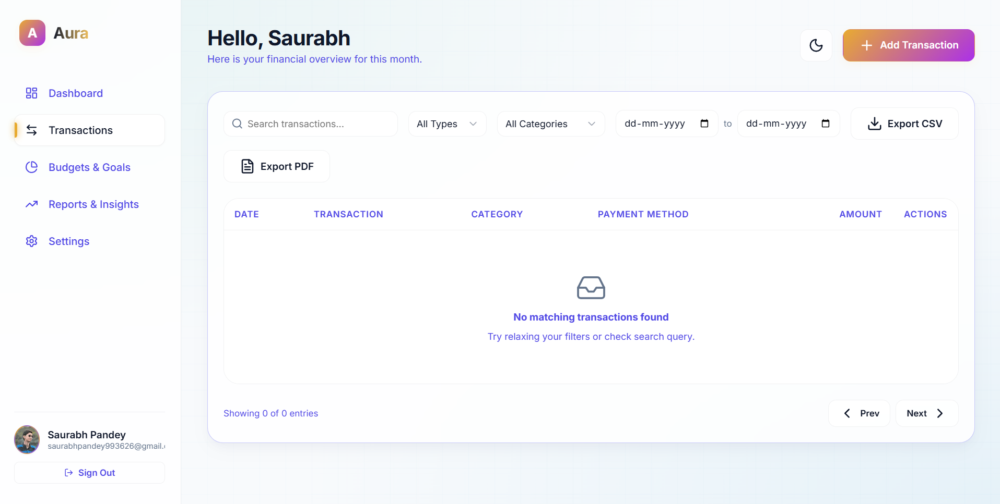

# 💰 Expense Tracker

A modern and responsive **Expense Tracker** web application that helps users manage their personal finances efficiently. Users can securely track income, expenses, and account balances with Firebase Authentication and Cloud Firestore.


---

# 📸 Preview

> Add your screenshots inside the **assets** folder.

| Dashboard | Transactions |
|-----------|--------------|
|  |  |

---

# 🚀 Live Demo

🔗 **Website:** (https://expense-tracker-nine-tau-45.vercel.app/)

---

# ✨ Features

- 💳 Add Income
- 💸 Add Expenses
- 📊 Automatic Balance Calculation
- 📜 Transaction History
- 🔍 Search Transactions
- 🗑️ Delete Transactions
- ☁️ Cloud Firestore Database
- 🔐 Firebase Authentication
- 📱 Responsive Design
- ⚡ Fast & Lightweight UI

---

# 🛠️ Built With

- HTML5
- CSS3
- JavaScript (ES6)
- Firebase Authentication
- Cloud Firestore
- Firebase Hosting / Vercel

---

# 📂 Project Structure

```text
Expense-Tracker/
│
├── assets/
│   ├── dashboard.png
│   ├── transaction.png
│   └── ...
│
├── app.js
├── firebase-config.js
├── index.html
├── styles.css
│
├── .firebaserc
├── firebase.json
├── firestore.rules
├── firestore.indexes.json
├── .gitignore
├── package.json
│
└── README.md
```

---

# ⚙️ Installation

### Clone the Repository

```bash
git clone https://github.com/saurabhxpandey/expense-tracker.git
```

### Open Project

```bash
cd expense-tracker
```

### Install Dependencies

```bash
npm install
```

### Run

Open **index.html** in your browser or use **Live Server**.

---

# 🔥 Firebase Configuration

Replace your Firebase configuration inside **firebase-config.js**

```javascript
const firebaseConfig = {
  apiKey: "YOUR_API_KEY",
  authDomain: "YOUR_PROJECT.firebaseapp.com",
  projectId: "YOUR_PROJECT_ID",
  storageBucket: "YOUR_PROJECT.appspot.com",
  messagingSenderId: "XXXXXXXXXX",
  appId: "XXXXXXXXXX"
};
```

---

# 📷 Screenshots

## Dashboard


---

## Transactions


---

# 📌 Future Enhancements

- 📊 Expense Analytics
- 📅 Monthly Reports
- 📂 Category-wise Expenses
- 📈 Interactive Charts
- 🌙 Dark Mode
- 📤 Export to PDF & Excel
- 💰 Budget Planner
- 🌍 Multi-Currency Support

---

# 🤝 Contributing

Contributions are welcome!

1. Fork the repository

2. Create a branch

```bash
git checkout -b feature-name
```

3. Commit your changes

```bash
git commit -m "Added new feature"
```

4. Push to GitHub

```bash
git push origin feature-name
```

5. Create a Pull Request

---

# ⭐ Show Your Support

If you found this project helpful, please give it a ⭐ on GitHub.

---

# 👨‍💻 Author

**Saurabh Pandey**

- GitHub: https://github.com/saurabhxpandey
- Portfolio: https://portfolio-website-nine-rust-36.vercel.app/

---

# 📄 License

This project is licensed under the **MIT License**.
